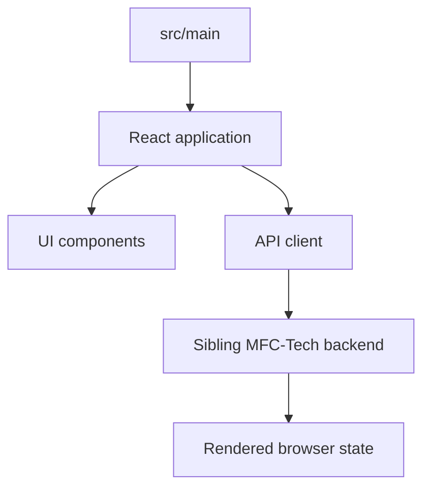

# MFC-Tech frontend

React/Vite client for the MFC-Tech application.

## Run locally

```bash
npm install
npm run dev
```

Run the sibling API from `../backend` at the same time and update the client API configuration if the backend uses a non-default port.

## Build and lint

```bash
npm run build
npm run lint
npm run preview
```

Source files are in `src/`; generated Vite output belongs in `dist/`.

## Frontend architecture


